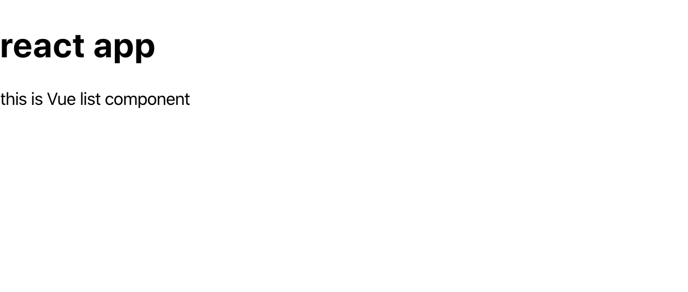
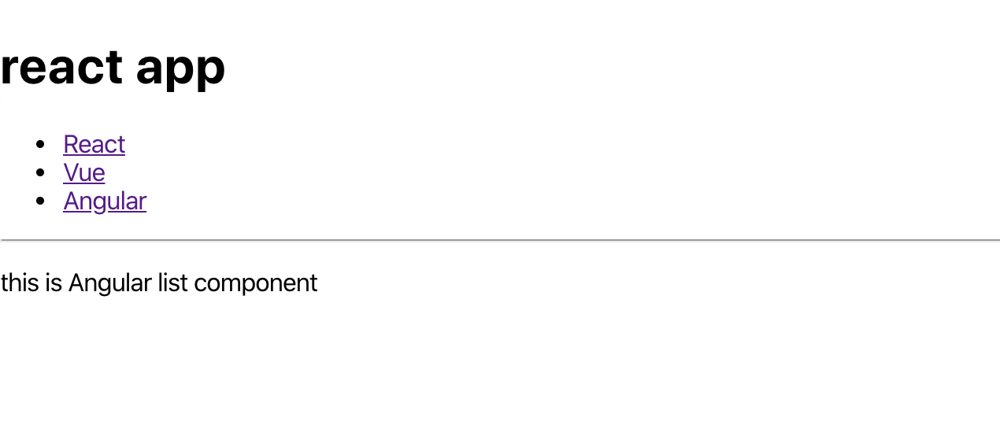

# router機能

実際の web アプリケーションでは，処理ごとにページを分けて行いたい場合が多い．

ここまでの実装では，1 つのページに全てのコンポーネントを表示していたが，本項ではコンポーネントを別ページで表現する．そのままの記述ではページ遷移が行えないので，新しく`react-router`のライブラリをインストールする．


## `react-router`のインストール

ターミナルで**作業ディレクトリにいることを確認**し，下記コマンドを実行する．

```bash
$ npm install react-router-dom
```

>【解説】ルーティング
>
>- 通常，React で web アプリケーションを実装すると，コンポーネントが切り替わっても URL は変化しない．
>- この 2 つを関連づけて，URL からアプリ内の特定のコンポーネントにアクセスできるようにしたり，逆にアプリ内での状態変化を URL に反映させたりすることをルーティングと呼ぶ．
>- ルーティングしておくと，ブラウザの戻るボタンで戻ったり，URL を打って特定のページに直接アクセスできたりするのでいい感じになる．


## ルーティングの定義

`react-router`の機能を用いてルーティングを実装する．

`App.jsx`を以下のように編集する．

```jsx
// App.jsx
import React from 'react';
import Booklist from './components/Booklist';
import { BrowserRouter, Route, Link } from 'react-router-dom';  // 追加

const App = () => {
  const languages = ['React', 'Vue', 'Angular'];
  return (
    <BrowserRouter>
      <h1>react app</h1>
      <Route exact path='/' component={Booklist} />
      <Route path='/vue' component={Booklist} />
      <Route path='/angular' component={Booklist} />
    </BrowserRouter>
  );
}
export default App;
```

- `<BrowserRouter>`の中に`<Route>`を置き，`path`に対応させたい URL を，`component`に描画したいコンポーネントを渡す．
- `exact`を設定しないと`path`が入力した URL に前方一致していれば描画されるため（全部`/`で認識されてしまう），`path='/'`には`exact`を設定している．
- この時点では，各コンポーネントに`props`を渡していないため，URL を変更しても表示は変化しない．

>**💡 Key Point**
>
>router機能を使用したい場合は，コンポーネントを必ず`<BrowserRouter>`内に配置すること．


## ルーティングしながら props を渡す

- せっかく`props`でデータを渡していたので，ルーティング使用時も`props`を活用したい．
- しかし，` component={Booklist}`のように記述すると props を記述する場所がない．
- `render`を使用すると`props`を使用できる．

`App.jsx`を以下のように編集する．

```jsx
// App.jsx
import React from "react";
import { Booklist } from "./components/Booklist";
import { BrowserRouter, Route, Link } from 'react-router-dom';

const App = () => {
  const languages = ["React", "Vue", "Angular"];
  return (
    <BrowserRouter>
      <h1>react app</h1>
      <Route
        exact
        path="/"
        render={(props) => <Booklist language={languages[0]} />}
      />
      <Route
        path="/vue"
        render={(props) => <Booklist language={languages[1]} />}
      />
      <Route
        path="/angular"
        render={(props) => <Booklist language={languages[2]} />}
      />
    </BrowserRouter>
  );
};
export default App;

```

こうするとルーティングと`props`を併用できる．

ブラウザで`localhost:3000/vue`などと URL を入力して表示を確認しよう．




## リンクを貼る

- 毎回 URL 入力はダルい．
- せっかくルーティングを実装したので，リンクを張ってブラウザ上で移動できるようにしたい．
- `react-router`の`Link`機能を使うと簡単にリンクを作成できる．

`App.jsx`を以下のように編集する．

```jsx
// App.jsx
import React from "react";
import { Booklist } from "./components/Booklist";
import { BrowserRouter, Route, Link } from 'react-router-dom';

const App = () => {
  const languages = ["React", "Vue", "Angular"];
  return (
    <BrowserRouter>
      <h1>react app</h1>
      <ul>
        <li>
          <Link to="/">React</Link>
        </li>
        <li>
          <Link to="/vue">Vue</Link>
        </li>
        <li>
          <Link to="/angular">Angular</Link>
        </li>
      </ul>
      <hr />
      <Route
        exact
        path="/"
        render={(props) => <Booklist language={languages[0]} />}
      />
      <Route
        path="/vue"
        render={(props) => <Booklist language={languages[1]} />}
      />
      <Route
        path="/angular"
        render={(props) => <Booklist language={languages[2]} />}
      />
    </BrowserRouter>
  );
};
export default App;

```

`<Link>`タグの`to`部分に移動したい URL を書いておくと，`<a>`タグのようにリンクしてくれる．

ブラウザ画面で移動できることを確認しよう．


